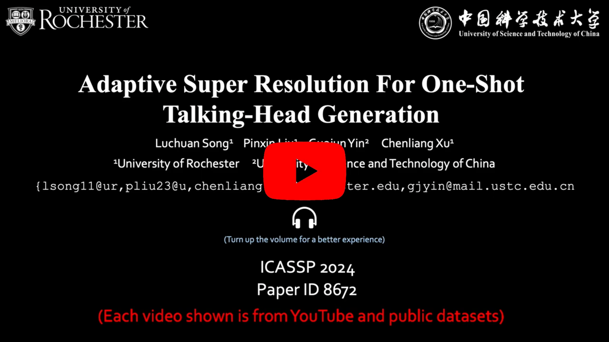

# Adaptive Super Resolution For One-Shot Talking-Head Generation
The repository for ICASSP2024 Adaptive Super Resolution For One-Shot Talking-Head Generation (AdaSR TalkingHead)

## Abstract
The one-shot talking-head generation learns to synthesize a talking-head video with one source portrait image under the driving of same or different identity video. Usually these methods require plane-based pixel transformations via Jacobin matrices or facial image warps for novel poses generation. The constraints of using a single image source and pixel displacements often compromise the clarity of the synthesized images. Some methods try to improve the quality of synthesized videos by introducing additional super-resolution modules, but this will undoubtedly increase computational consumption and destroy the original data distribution. In this work, we propose an adaptive high-quality talking-head video generation method, which synthesizes high-resolution video without additional pre-trained modules. Specifically, inspired by existing super-resolution methods, we down-sample the one-shot source image, and then adaptively reconstruct high-frequency details via an encoder-decoder module, resulting in enhanced video clarity. Our method consistently improves the quality of generated videos through a straightforward yet effective strategy, substantiated by quantitative and qualitative evaluations. The code and demo video are available on: https://github.com/Songluchuan/AdaSR-TalkingHead/

## Updates

- [03/2024] Inference code and pretrained model are released.
- [03/2024] Arxiv Link: https://arxiv.org/abs/2403.15944.
- [COMING] Super-resolution model (based on StyleGANEX and ESRGAN).
- [COMING] Train code and processed datasets.


## Installation

**Clone this repo:**
```bash
git clone git@github.com:Songluchuan/AdaSR-TalkingHead.git
cd AdaSR-TalkingHead
```
**Dependencies:**

We have tested on:
- CUDA 11.3-11.6
- PyTorch 1.10.1
- Matplotlib 3.4.3; Matplotlib 3.4.2; opencv-python 4.7.0; scikit-learn 1.0; tqdm 4.62.3

## Inference Code 


1. Download the pretrained model on google drive: https://drive.google.com/file/d/1g58uuAyZFdny9_twvbv0AHxB9-03koko/view?usp=sharing (it is trained on the HDTF dataset), and put it under checkpoints/<br>


2. The demo video and reference image are under ```DEMO/```

   
3. The inference code is in the ```run_demo.sh```, please run it with 

```
bash run_demo.sh
```

4. You can set different demo image and driven video in the ```run_demo.sh```
```
--source_image DEMO/demo_img_3.jpg
```
 and 
```
--driving_video DEMO/demo_video_1.mp4
```


## Video
<div align="center">
  <a href="https://www.youtube.com/watch?v=B_-3F51QmKE" target="_blank">
    
  </a>
</div>


## Citation

```bibtex
@inproceedings{song2024adaptive,
  title={Adaptive Super Resolution for One-Shot Talking Head Generation},
  author={Song, Luchuan and Liu, Pinxin and Yin, Guojun and Xu, Chenliang},
  year={2024},
  organization={IEEE International Conference on Acoustics, Speech, and Signal Processing}
}
```

## Acknowledgments

The code is mainly developed based on [styleGANEX](https://github.com/williamyang1991/StyleGANEX), [ESRGAN](https://github.com/xinntao/ESRGAN) and [unofficial face2vid](https://github.com/zhanglonghao1992/One-Shot_Free-View_Neural_Talking_Head_Synthesis). Thanks to the authors contribution.

